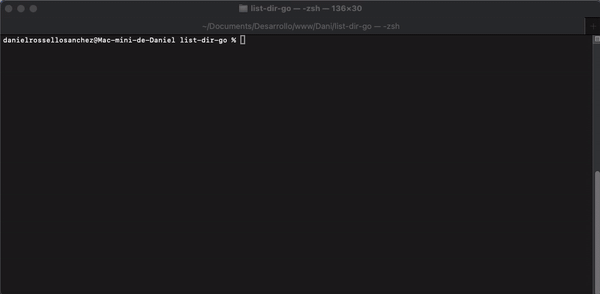

# ListDir

**ListDir** es una herramienta de línea de comandos construida en Go, diseñada para listar recursivamente archivos y
directorios. Permite a los usuarios especificar el directorio a listar y opcionalmente ignorar ciertos directorios. Por
defecto, ignora directorios comunes como `.git`, `node_modules`, `vendor`, `.idea`, y `.vsc`.

## Características Clave

- **Listado de Directorios**: Lista todos los archivos y subdirectorios dentro de un directorio especificado.
- **Directorios Ignorados**: Permite a los usuarios especificar directorios a ignorar, con directorios ignorados por
  defecto como `.git`, `node_modules`, `vendor`, `.idea`, y `.vsc`.
- **Opciones Personalizables**: Los usuarios pueden especificar el directorio a listar y los directorios a ignorar
  mediante flags de línea de comandos.


## Instalación en MAC con Brew



## Instalación en MAC con Brew
```Bash
brew tap drossan/tools
brew install list-dir
```
## Uso
```Bash
list-dir
```

### Salida
```text
/list-dir-go/
|-- .github
|   |-- workflows
|   |   |-- release.yml
|-- .gitignore
|-- .goreleaser.yaml
|-- LICENSE
|-- README.md
|-- app.yaml
|-- cmd
|   |-- root.go
|-- go.mod
|-- go.sum
|-- list_dir_output.txt
|-- main.go
```